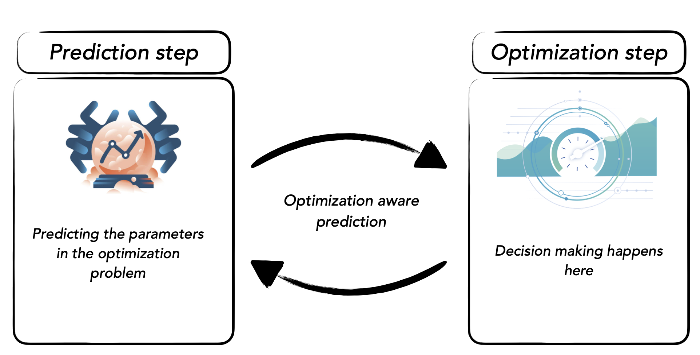

# SPO++ (Smart**er** Predict Then Optimize)

Code for the techinical report ''[Smarter Predict, Then Optimize](https://drive.google.com/file/d/1tm94O93VBI6a4JLK49UzOtGCf0hnhmGE/view?usp=sharing)'' by Sina Aghaei. This code is based on the code from the paper [Smart Predict, Then Optimize](https://arxiv.org/abs/1710.08005) . ( [GitHub link](https://github.com/paulgrigas/SmartPredictThenOptimize)) 

The code will run in python3 ( version 7 and higher) and require [Gurobi9.x](https://www.gurobi.com/downloads/gurobi-optimizer-eula/) solver. The required packages are listed in `requirements.txt`.

***

## Overview

The content of this repository is as follows:

- `solver` contains the reformulation file for each approach and calibration and evaluation modules. The calibration module solves each instance over a grid of given values for the hyperparameters and returns  ones with better peformance on the calibration set. The evaluation moduel provide functions to compute various loss for each solution.

- `oracle` contains the optimization oracle such as shortest path problem. The oracle solves the problem for the given parameter. 

- `tests` contains unit tests to check the sanity of various modules.

- `utils` contains the graph module which provides the graph for the shortest path problem and the data generator module which generates the synthetic data.

- `experiments` contains the scripts to set up the whole pipeline and generate the results.

- `results` contains the tabular resuls of the experiments.

- `plots` contains the R script for generating figures from the tabular results.

There is also a jupyter notebook `sp_example` which reproduce the given example in the report.
